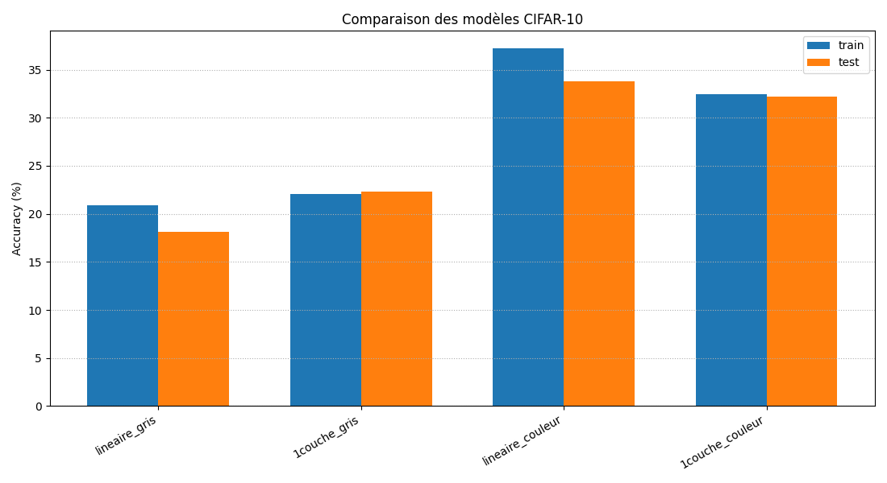

# Projet ML — MNIST, CIFAR-10 & CBIS-DDSM

Projet de Machine Learning (module SM604) implémentant **à la main avec NumPy**
des réseaux de neurones (linéaire, 1 et 2 couches cachées, rétropropagation) puis
des **CNN PyTorch**, appliqués à trois problèmes croissants en difficulté :
chiffres manuscrits (MNIST), images couleur (CIFAR-10) et diagnostic médical par
imagerie (CBIS-DDSM, mammographies). Comparaison rigoureuse des modèles, étude du
learning rate, et analyse critique des résultats (fuite de données identifiée et
corrigée sur CBIS-DDSM).



## Résultats clés

| Partie | Meilleur modèle | Résultat (test) |
|---|---|---|
| MNIST (classification de chiffres) | Réseau 1 couche cachée (NumPy) | 2.43 % d'erreur |
| CIFAR-10 (images couleur, 10 classes) | CNN (PyTorch) | 46.0 % d'accuracy |
| CBIS-DDSM (mammographies, malin/bénin) | CNN (PyTorch) | ROC-AUC 0.658, split par patient (sans fuite de données) |

## Structure du projet

| Dossier | Contenu |
|---|---|
| `MNIST/` | Modèles NumPy (linéaire, 1 et 2 couches cachées), étude du learning rate, comparatif |
| `CIFAR-10/` | Modèles NumPy (gris/couleur), convolution manuelle, CNN PyTorch |
| `CBIS-DDSM/` | Prétraitement (split officiel par patient), CNN PyTorch, métriques médicales |
| `rapports/` | Rapports détaillés par partie (méthodologie, graphiques, interprétation) |
| `results/` | Graphiques, métriques et matrices de confusion générés |

## Installation

```bash
python -m venv .venv
.venv\Scripts\activate          # Windows
pip install -r requirements.txt
```

## 1. MNIST — Classification de chiffres manuscrits

Tous les fichiers se trouvent dans `MNIST/`.

- `preprocessing.py` : chargement, reshape (60000, 784), normalisation, one-hot encoding.
- `MNIST_lineaire.py` : modèle linéaire sans couche cachée, implémenté à la main avec NumPy (softmax, cross-entropy, forward/backward, descente de gradient). **8.77 % d'erreur (test)**.
- `MNIST_couche_cachee.py` : 1 couche cachée (128 neurones, ReLU), rétropropagation manuelle. **2.43 % d'erreur (test)**.
- `MNIST_2couche_cachee.py` : 2 couches cachées (128, 64 neurones). **2.61 % d'erreur (test)**.
- `analyse.py` : comparatif des 3 modèles, matrice de confusion, images mal classées, projection PCA 2D.
- `etude_learning_rate.py` : étude automatique de 7 valeurs de learning rate → learning rate optimal autour de **0.01** (voir `rapports/RAPPORT_MNIST.md`).

## 2. CIFAR-10 — Classification d'images couleur

Tous les fichiers se trouvent dans `CIFAR-10/`.

| Modèle | Accuracy (test, sous-ensemble) |
|---|---|
| Linéaire (gris) | 17.7 % |
| Linéaire (couleur) | 34.1 % |
| 1 couche cachée (gris) | 34.8 % |
| 1 couche cachée (couleur) | 43.9 % |
| **CNN (PyTorch, couleur)** | **46.0 %** |

- `convolution.py` : implémentation manuelle de la convolution 2D (zero-padding, max-pooling, 6 filtres : flou, netteté, détection de bords).
- `CNN.py` : CNN PyTorch (Conv2d × 4 + MaxPool × 2 + Linear), early stopping, sauvegarde du meilleur modèle, courbes loss/accuracy et matrice de confusion.
- `analyse_cifar.py` : comparatif des 5 modèles (voir `rapports/RAPPORT_CIFAR10.md`).

## 3. CBIS-DDSM — Classification de mammographies

Classification binaire (malin vs bénin) sur 2857 vues issues de 1460 patients.
Le dataset (version JPEG) n'est **pas inclus** dans le dépôt : à télécharger sur
[Kaggle](https://www.kaggle.com/datasets/awsaf49/cbis-ddsm-breast-cancer-image-dataset)
et à placer dans `CBIS-DDSM/archive/`.

- `preprocessing.py` : lecture des CSV officiels, association image/label, **split officiel par patient** (train/test CBIS-DDSM + validation découpée par patient) pour éviter toute fuite de données, gestion du déséquilibre de classes (`pos_weight`).
- `CNN_cbis.py` : CNN (3 blocs Conv+ReLU+MaxPool + 2 couches denses), Adam, `BCEWithLogitsLoss` pondérée, early stopping.
- `analyse_cbis.py` : matrice de confusion, courbe ROC, analyse médicale des faux positifs/négatifs.

**Résultat (test, split officiel par patient)** : Accuracy 0.602 | Precision 0.512 | Recall 0.634 | F1 0.567 | **ROC-AUC 0.658**.

> Une version antérieure avec un split aléatoire par image donnait un AUC de 0.995 —
> mais il s'agissait d'une **fuite de données** (mêmes patients en train et en test),
> corrigée depuis. Voir `rapports/RAPPORT_CBIS_DDSM.md` pour l'analyse complète.

## Rapports

Le dossier `rapports/` contient une analyse détaillée par partie :
`RAPPORT_MNIST.md`, `RAPPORT_CIFAR10.md`, `RAPPORT_CBIS_DDSM.md`.

## Notes d'exécution

- Les scripts qui sauvegardent dans `results/`/`params/` doivent être lancés depuis la racine du projet (ex. `python MNIST/etude_learning_rate.py`).
- `CNN.py` et `CNN_cbis.py` nécessitent PyTorch : utiliser l'interpréteur du venv (`.venv\Scripts\python.exe`).
- L'entraînement complet sur MNIST (60 000 images) peut prendre plusieurs minutes ; réduire à `X_train[:5000]` pour un test rapide.
